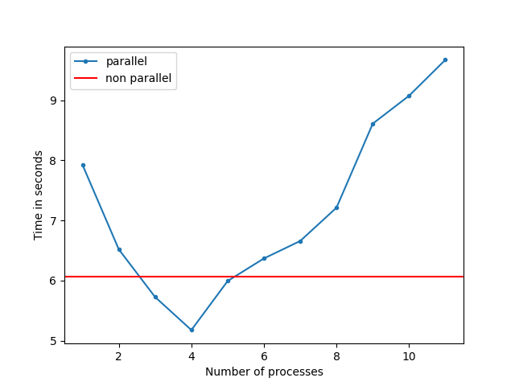

## Description
Parallelization of K-Means clustering algorithm
## 1.1 Algorithm
K-Means clustering:
1. Randomly init N centroids
2. Label each sample depending on which centroid is closest to the sample
3. Moving the centroid,  calculating the average  between all the samples that  belong  to  this  centroid
4. If the centroids have changed, then go to step 2, otherwise we finish

## 1.2 Parallelization method
**map** a heavy  function to a **pool** of processes

## 2.1 Reproduce results (env)
* Python 3.8.8
```Python
pip install numpy==1.21.1 matplotlib==3.7.5
```
## 2.2 Dataset
I genrate data using numpy.uniform. You can change **number of clusters** and **number of features**
```Python
python generate_data.py <n_clusters> <n_features>
```
## 2.2 Run the code
Code generates **result.png** file that contains graph with speedup results
```Python
python kmeans.py
```

## 3. How to parallel algorithm
Divide the data into M chunks, where M is the number of processes. Each process will receive its own chunk of data and perform **step №2 (from 1.1)**, since it is at this step that the heaviest calculations take place.

## 4. Speedup



